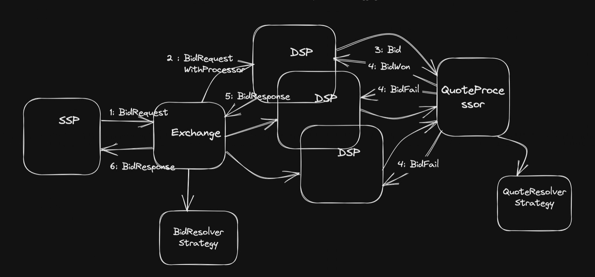
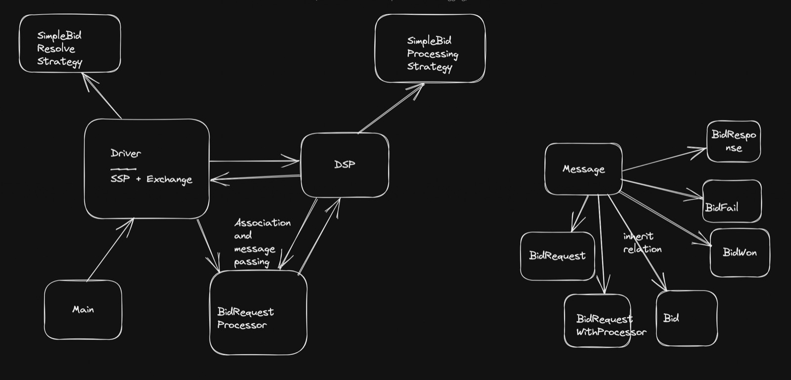

## Ad Bidding System: Demand Side Processing
### Introduction

Prerequisites:
* Java17
* Maven

Simple bidding process.
Focus is on DSP response processing as per assignment.
SSP and Exchange are combined into a kind of Driver program called SspAndExchangeSimulator to simulate for DSP.

You could start by reading and running com.adbiddingsystem.domain.dsp.SimpleBidProcessingStrategyTest, and to lesser 
extent SimpleBidResolveStrategyTest.java.

### High Level Design

Message passing reactive style has been adopted much like actors of Akka or Erlang



### Class Diagram



### How to run simulator, and its output

Run com.adbiddingsystem.Main.

Sample output json on console is as below:

```aidl
{
  "requestId" : "br1",
  "bidRequest" : {
    "requestId" : "br1",
    "url" : "a.apple.com",
    "country" : "CA",
    "dimension" : {
      "length" : 100,
      "height" : 150
    }
  },
  "wonBid" : {
    "requestId" : "br1",
    "campaign" : {
      "id" : "cid1",
      "targetedCountry" : "CA",
      "targetedDomain" : "apple.com",
      "dimensions" : [ {
        "length" : 90,
        "height" : 150
      } ]
    },
    "campaigns" : [ {
      "id" : "cid1",
      "targetedCountry" : "CA",
      "targetedDomain" : "apple.com",
      "dimensions" : [ {
        "length" : 100,
        "height" : 100
      }, {
        "length" : 200,
        "height" : 100
      } ]
    }, {
      "id" : "cid2",
      "targetedCountry" : "US",
      "targetedDomain" : "apple.com",
      "dimensions" : [ {
        "length" : 100,
        "height" : 100
      }, {
        "length" : 100,
        "height" : 200
      } ]
    } ],
    "quote" : 0.48
  },
  "evaluationTime" : 1011
}
```